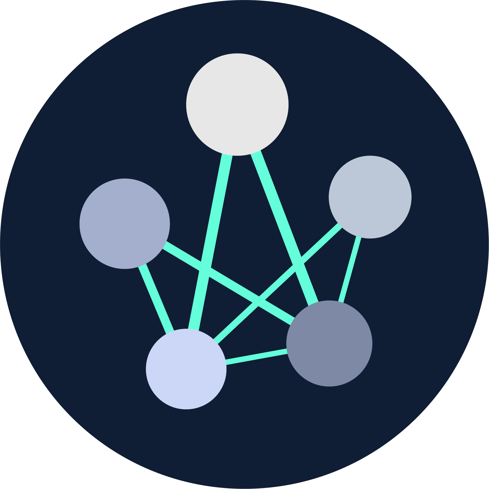
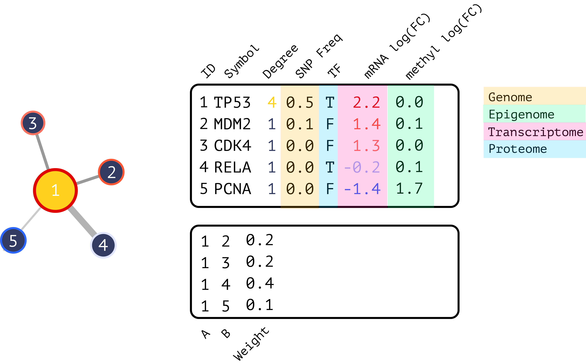

<!-- README.md is generated from README.Rmd. Please edit that file -->

```{r, include=FALSE}
knitr::opts_chunk$set(message=FALSE, warning=FALSE, collapse=FALSE, comment="")
options(width=600)
devtools::load_all()

# For examples
library(ndexr)
```

# bieulergy




The goal of bieulergy is to facilitate interactive network biology in R, specifically the analysis, visualization, and comparison of biological regulatory networks. This includes building out R command-line functions geared towards biological networks as well as interactive analysis through R Shiny. 

## Documentation

Please visit the [documentation](https://montilab.github.io/bieulergy) for a comprehensive overview.

## Gitter
Feel free to bring your questions, comments, or feedback to our [gitter](https://gitter.im/bieulergy/community) channel.

## Installation

We recommend the latest version of R (>= 4.0.0) and installation directly from Github.

```r
devtools::install_github("montilab/bieulergy")
```

## Usage

Networks are represented as `interactive.omics.network` objects with node/edge-level properties for mapping gene/protein symbols, centrality measures, and integrating multi-omics data layers into your analysis. These are R6 objects that extend `omics.network` objects to facilitate interactive analyses. You can find more information about `omics.network` objects [here](https://github.com/montilab/omics-network).



```{r, eval=FALSE}
library(bieulergy)
```

### Interactive Omics Network Object

```{r, eval=FALSE}
library(ndexr)
```

```{r}
ndex <- function(uuid) {
    ndexcon <- ndexr::ndex_connect()
    data <- ndexr::ndex_get_network(ndexcon, uuid)
    mat <- as.matrix(data$edges)
    storage.mode(mat) <- "character"
    ig <- igraph::graph_from_edgelist(mat[,c("s", "t")], directed=FALSE)
    ids <- data$nodes[match(as.numeric(igraph::as_ids(V(ig))), data$nodes[,"@id"]), "n"]
    V(ig)$label <- ids
    return(ig)
}
```

```{r}
# Global landscape of HIV–human protein complexes.
# Jaeger et al. Nature. 2011 Dec 21; 481(7381): 365–370
# @UUID: 1cbe89ab-fb5d-11e9-bb65-0ac135e8bacf
# https://www.ndexbio.org/viewer/networks/1cbe89ab-fb5d-11e9-bb65-0ac135e8bacf

ig <- ndex("1cbe89ab-fb5d-11e9-bb65-0ac135e8bacf")
ionet <- bieulergy::create.ionet(ig, type="ig")
```

```{r}
str(ionet$properties)
```

```{r}
head(ionet$nodes)
```

Graph and node properties are pre-computed for fast interactive rendering and analysis.

```{r}
head(ionet$pca$var$contrib)
```

### Multiple Network Objects

Many of the downstream functions expect one or more `interactive.omics.network` objects for comparative analyses. 

```{r}
# Simulated networks from yeast data by Kristina Hanspers
# @UUID: 7831a991-5767-11ea-bfdc-0ac135e8bacf
# https://www.ndexbio.org/viewer/networks/7831a991-5767-11ea-bfdc-0ac135e8bacf

yeast.networks <- readRDS(file.path(system.file("extdata", package="bieulergy"), "yeast-networks.rds"))
```

```{r}
is(yeast.networks, "list")
sapply(yeast.networks, is)
```

```{r}
yeast.1 <- yeast.networks$Yeast_1
head(yeast.1$nodes)
```

Here is an example of plotting the top nodes by degree centrality across networks.

```{r, fig.width=10}
bieulergy::networks.tnodes(networks=yeast.networks, 
                           metric="degree",
                           symbols=TRUE,
                           size=5,
                           top=10)
```

### Web Interface

Bieulergy is an R package and a Shiny application. Some functionality is exclusive to one or the other but there is a lot of overlap. The Shiny application is ideal for rapid analysis and comparison while the command line is more suitable for advanced custom analyses. 

```{r, eval=FALSE}
bieulergy::run.shiny()
```

Or run with Docker...

```sh
git clone https://github.com/montilab/bieulergy
cd bieulergy
docker build --tag montilab/bieulergy:latest .
```

Launch the package within a Docker environment..

```sh
docker run -d -p 8787:8787 -e PASSWORD=bieulergy montilab/bieulergy:latest
```

Run the Shiny application. Go to http://localhost:8787 in the browser and you will be promted:

username: rstudio  
password: bieulergy   

Then enter the following:
```r
library(bieulergy)
bieulergy::run.shiny()
```

Please refer to the [documentation](https://montilab.github.io/bieulergy) for more examples.
