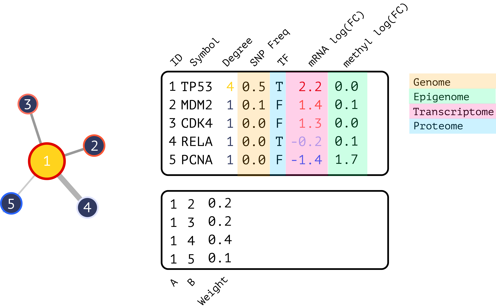

<!-- README.md is generated from README.Rmd. Please edit that file -->

# bieulergy


The goal of bieulergy is to facilitate interactive network biology in R,
specifically the analysis, visualization, and comparison of biological
regulatory networks. This includes building out R command-line functions
geared towards biological networks as well as interactive analysis
through R Shiny.

## Documentation

Please visit the [documentation](https://montilab.github.io/bieulergy)
for a comprehensive overview.

## Gitter

Feel free to bring your questions, comments, or feedback to our
[gitter](https://gitter.im/bieulergy/community) channel.

## Installation

We recommend the latest version of R (\>= 4.0.0) and installation
directly from Github.

``` r
devtools::install_github("montilab/bieulergy")
```

## Usage

Networks are represented as `interactive.omics.network` objects with
node/edge-level properties for mapping gene/protein symbols, centrality
measures, and integrating multi-omics data layers into your analysis.
These are R6 objects that extend `omics.network` objects to facilitate
interactive analyses. You can find more information about
`omics.network` objects
[here](https://github.com/montilab/omics-network).



``` r
library(bieulergy)
```

### Interactive Omics Network Object

``` r
library(ndexr)
```

``` r
ndex <- function(uuid) {
    ndexcon <- ndexr::ndex_connect()
    data <- ndexr::ndex_get_network(ndexcon, uuid)
    mat <- as.matrix(data$edges)
    storage.mode(mat) <- "character"
    ig <- igraph::graph_from_edgelist(mat[,c("s", "t")], directed=FALSE)
    ids <- data$nodes[match(as.numeric(igraph::as_ids(V(ig))), data$nodes[,"@id"]), "n"]
    V(ig)$label <- ids
    return(ig)
}
```

``` r
# Global landscape of HIV–human protein complexes.
# Jaeger et al. Nature. 2011 Dec 21; 481(7381): 365–370
# @UUID: 1cbe89ab-fb5d-11e9-bb65-0ac135e8bacf
# https://www.ndexbio.org/viewer/networks/1cbe89ab-fb5d-11e9-bb65-0ac135e8bacf

ig <- ndex("1cbe89ab-fb5d-11e9-bb65-0ac135e8bacf")
ionet <- bieulergy::create.ionet(ig, type="ig")
```

``` r
str(ionet$properties)
```

    List of 4
     $ nodes     : int 453
     $ edges     : num 499
     $ density   : num 0.00487
     $ clustering: num 0

``` r
head(ionet$nodes)
```

``` 
       id label symbol degree      eigen betweenness stress
942   942   942    942     50 0.55159754  6204.11111  42589
1022 1022  1022   1022      1 0.05997156     0.00000      0
1020 1020  1020   1020      1 0.05997156     0.00000      0
 792  792   792    792      2 0.16869497    85.44444   1602
1017 1017  1017   1017      1 0.05997156     0.00000      0
1015 1015  1015   1015      1 0.05997156     0.00000      0
```

Graph and node properties are pre-computed for fast interactive
rendering and analysis.

``` r
head(ionet$pca$var$contrib)
```

``` 
               Dim.1     Dim.2        Dim.3        Dim.4
degree      26.07208  4.763222 6.774052e+01  1.424178812
eigen       15.05581 84.934785 5.262416e-04  0.008874053
betweenness 28.87808  5.366217 2.387746e+01 41.878247044
stress      29.99403  4.935776 8.381493e+00 56.688700091
```

### Multiple Network Objects

Many of the downstream functions expect one or more
`interactive.omics.network` objects for comparative analyses.

``` r
# Simulated networks from yeast data by Kristina Hanspers
# @UUID: 7831a991-5767-11ea-bfdc-0ac135e8bacf
# https://www.ndexbio.org/viewer/networks/7831a991-5767-11ea-bfdc-0ac135e8bacf

yeast.networks <- readRDS(file.path(system.file("extdata", package="bieulergy"), "yeast-networks.rds"))
```

``` r
is(yeast.networks, "list")
```

    [1] TRUE

``` r
sapply(yeast.networks, is)
```

``` 
                    Yeast_1                     Yeast_2                     Yeast_3 
"interactive.omics.network" "interactive.omics.network" "interactive.omics.network" 
```

``` r
yeast.1 <- yeast.networks$Yeast_1
head(yeast.1$nodes)
```

``` 
     id symbol is_tf   lfc_mrna     snp_frq label degree        eigen betweenness stress
749 749   MTH1 FALSE -0.4385177 0.035319994   749      2 2.661820e-07     247.000   1361
751 751   SNF3 FALSE  0.1285503 0.003035238   751      1 5.257070e-08       0.000      0
109 109   LSM8 FALSE -0.5849400 0.062844766   109      7 1.295192e-06    3680.751  23693
743 743   ASN1 FALSE  1.1166966 0.229042875   743      1 2.299056e-04       0.000      0
692 692  SPC24 FALSE  0.2306554 0.009771783   692      3 1.164084e-03     493.000    617
740 740   GIP2 FALSE -0.5743279 0.060585153   740      2 2.958689e-03    1356.000   5772
```

Here is an example of plotting the top nodes by degree centrality across
networks.

``` r
bieulergy::networks.tnodes(networks=yeast.networks, 
                           metric="degree",
                           symbols=TRUE,
                           size=5,
                           top=10)
```

<!-- -->

### Web Interface

Bieulergy is an R package and a Shiny application. Some functionality is
exclusive to one or the other but there is a lot of overlap. The Shiny
application is ideal for rapid analysis and comparison while the command
line is more suitable for advanced custom analyses.

``` r
bieulergy::run.shiny()
```

Or run with Docker…

``` sh
git clone https://github.com/montilab/bieulergy
cd bieulergy
docker build --tag montilab/bieulergy:latest .
```

Launch the package within a Docker environment..

``` sh
docker run -d -p 8787:8787 -e PASSWORD=bieulergy montilab/bieulergy:latest
```

Run the Shiny application. Go to <http://localhost:8787> in the browser
and you will be promted:

username: rstudio  
password: bieulergy

Then enter the following:

``` r
library(bieulergy)
bieulergy::run.shiny()
```

Please refer to the
[documentation](https://montilab.github.io/bieulergy) for more examples.
